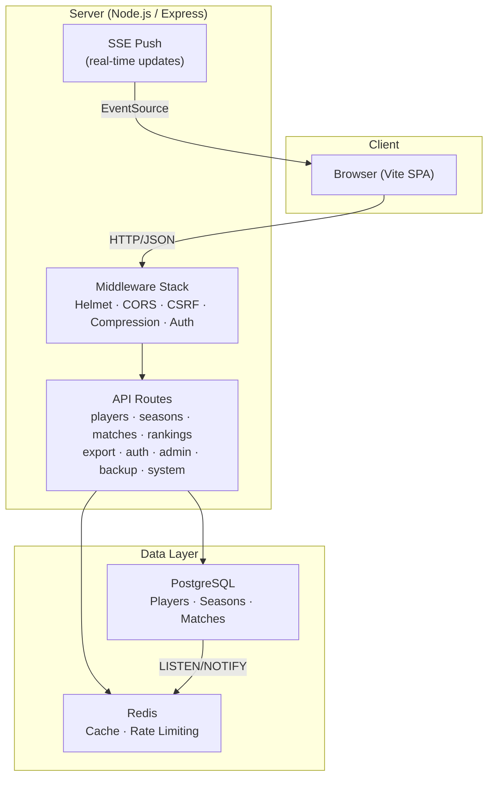
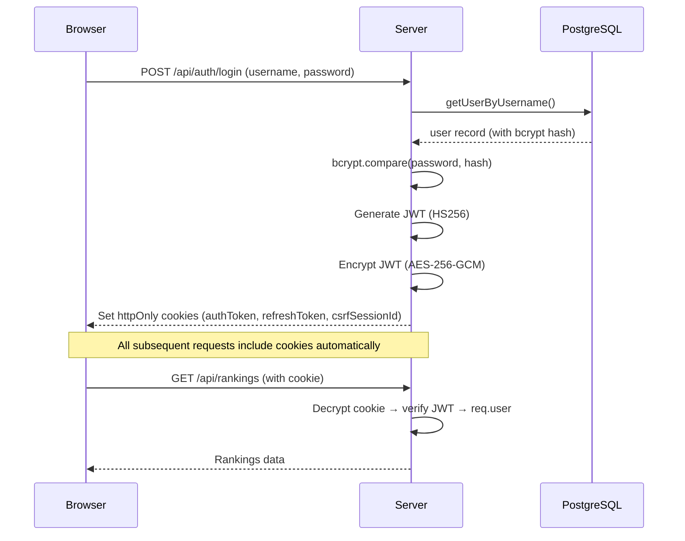
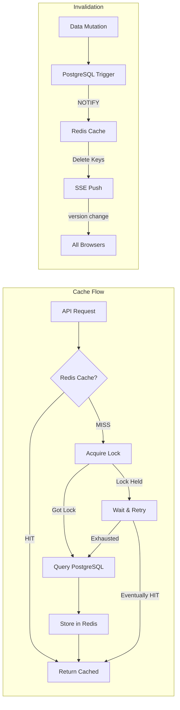

# Tennis Ranking System — Architecture

## System Overview



## Directory Structure

```
ranking/
├── config/                  # Environment & cookie config
│   ├── env.js               # Validates env vars, exports typed config
│   └── cookie.js            # Cookie defaults, path-clearing helpers
├── lib/                     # Core libraries
│   ├── jwt-encryption.js    # AES-256-GCM JWT encrypt/decrypt
│   ├── redis-cache.js       # Redis caching with stampede protection
│   └── security-helpers.js  # CSRF derivation, timing-safe compare
├── middleware/              # Express middleware
│   ├── auth.js              # authenticateToken, checkAuth, requireRole
│   ├── compression.js       # Brotli + gzip compression
│   ├── csrf.js              # Global CSRF protection
│   └── rate-limiter.js      # Dynamic rate limiting (Redis-backed)
├── routes/                  # API route modules
│   ├── admin.js             # Admin analytics
│   ├── backup.js            # Backup/restore
│   ├── export.js            # Excel export
│   ├── health.js            # Health checks (public + authenticated)
│   ├── matches.js           # Match CRUD
│   ├── players.js           # Player CRUD
│   ├── rankings.js          # Ranking queries
│   ├── seasons.js           # Season management
│   ├── system.js            # SSE, CSRF tokens, init, debug
│   └── users.js             # User account management
├── migrations/              # SQL migrations
├── tests/                   # Test suite (Vitest)
│   └── unit/                # Unit tests
├── src/                     # Frontend (Vite)
│   ├── main.js              # SPA entry point
│   └── style.css            # Design system
├── server.js                # Express app bootstrap (~340 lines)
├── database-postgresql.js   # Database schema + queries
├── ecosystem.config.cjs     # PM2 cluster configuration
├── Dockerfile               # Multi-stage Docker build
├── docker-compose.yml       # Full-stack Docker deployment
└── docker-compose.override.yml  # Dev overrides (expose PG/Redis ports)
```

## Deployment Modes

### 1. Docker (Recommended for Production)

```bash
# Full containerized stack (app + PostgreSQL + Redis)
docker compose up -d

# View logs
docker compose logs -f app
```

The app container runs PM2 inside Docker using `dumb-init` for proper PID 1 signal handling.

### 2. PM2 Bare Metal

```bash
# Prerequisites: PostgreSQL and Redis running on host
npm run build
pm2 start ecosystem.config.cjs --env production
pm2 save && pm2 startup
```

### 3. Direct Node.js

```bash
# Prerequisites: PostgreSQL and Redis running on host
npm run build
NODE_ENV=production node server.js
```

### 4. Development (Hybrid)

```bash
# Start PostgreSQL + Redis in Docker, app on host
docker compose up -d postgres redis
npm run dev-full    # starts Vite + Express concurrently
```

## Authentication Flow



## Cache Strategy



Key design decisions:
- **Startup cache**: Rankings, players, seasons are pre-loaded at boot (permanent, no TTL)
- **Stampede protection**: Distributed locks prevent multiple workers from rebuilding the same cache key
- **Auto-invalidation**: PostgreSQL triggers fire `NOTIFY cache_invalidation` on every INSERT/UPDATE/DELETE
- **Real-time sync**: SSE pushes version changes to all connected clients immediately

## Rate Limiting

- **Redis-backed**: Works across PM2 cluster workers
- **Dynamic scaling**: Limits reduce automatically when CPU > 80% or RAM > 85%
- **User-aware**: Authenticated users get 2–4x higher limits than anonymous users
- **Graceful degradation**: If Redis is down, rate limiting is bypassed (passOnStoreError)

## Security Layers

| Layer | Implementation |
|-------|---------------|
| Transport | HSTS (2 years), upgrade-insecure-requests |
| Headers | Helmet (CSP, X-Frame-Options, Permissions-Policy) |
| Authentication | JWT in AES-256-GCM encrypted httpOnly cookies |
| CSRF | HMAC-derived secrets + double-submit token pattern |
| Passwords | bcrypt with 14 rounds |
| Rate Limiting | Redis-backed, dynamic, user-aware |
| Input | express-validator on all endpoints |
| XSS | CSP, X-XSS-Protection, sanitizeResponse() |
