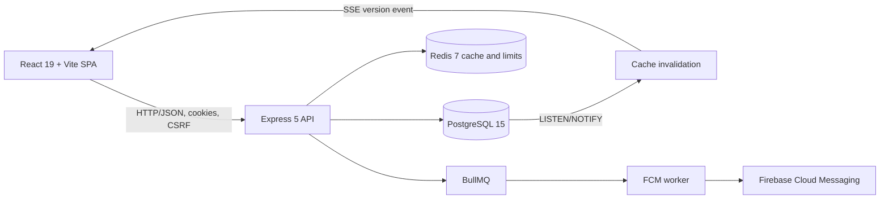

# Tennis Ranking System — Architecture

## System overview


```mermaid
graph LR
    Browser[React 19 + Vite SPA] -->|HTTP/JSON, cookies, CSRF| API[Express 5 API]
    API --> PG[(PostgreSQL 15)]
    API --> Redis[(Redis 7 cache and limits)]
    PG -->|LISTEN/NOTIFY| Cache[Cache invalidation]
    Cache -->|SSE version event| Browser
    API --> Queue[BullMQ]
    Queue --> Worker[FCM worker]
    Worker --> Firebase[Firebase Cloud Messaging]
```

All application source is TypeScript. Vite emits browser assets to `dist/`; TypeScript emits the Express server, database adapter, migration runners, and FCM worker to `build/`. Production executes only compiled Node.js files.

## Source layout

```text
ranking/
├── config/                  # Validated environment and cookie configuration
├── lib/                     # Cache, JWT, uploads, queue, AI parser, security helpers
├── middleware/              # Auth, CSRF, compression, and rate limiting
├── routes/                  # Injected Express router factories
├── migrations/              # Ordered, idempotent database migrations
├── scripts/                 # TypeScript migration runners and deployment helpers
├── shared/domain.ts         # Browser/server domain and API contracts
├── src/
│   ├── api/client.ts        # Typed fetch client, refresh rotation, CSRF, uploads
│   ├── app/                 # React shell and application context
│   ├── components/          # Shared React UI
│   ├── features/            # Domain feature components
│   ├── main.tsx             # Browser entry point
│   ├── react.css            # React layout additions
│   └── style.css            # Global design system
├── tests/unit/              # Backend unit tests
├── tests/frontend/          # jsdom/Testing Library React tests
├── types/express.d.ts       # Express request/response augmentation
├── database-postgresql.ts   # Production database adapter
├── server.ts                # HTTP application composition root
├── worker.ts                # BullMQ FCM worker
├── dist/                    # Generated browser artifact
└── build/                   # Generated Node.js artifact
```

Backend relative imports use `.js` extensions intentionally. TypeScript's NodeNext mode resolves those imports to `.ts` during development and preserves valid `.js` specifiers in compiled ESM.

## Frontend

`AppProvider` loads `/api/init`, stores the authenticated user and shared ranking data, and derives `canEdit`/`isAdmin` capabilities. Feature components own their local forms and detail queries. All HTTP access goes through `src/api/client.ts`, which:

- sends cookies on every request;
- obtains and sends `X-CSRF-Token` for mutations;
- performs one access-token refresh and retry on an expired session;
- normalizes root and `/tennis/` deployments from Vite's base path;
- provides typed JSON, upload, and download helpers.

The client listens to `/api/events`. A changed server data version reloads `/api/init`; if SSE disconnects, a 15-second `/api/data-version` poll takes over. This keeps auth state and domain data synchronized without duplicating the former browser cache layer.

## API composition

`server.ts` initializes configuration, PostgreSQL, Redis, security middleware, cache synchronization, static files, and router factories. Domain logic remains in injected route/service modules:

```typescript
export const createPlayerRouter = ({ db, checkAuth, rankingsCache }) => {
  const router = Router()
  router.get('/', checkAuth, asyncHandler(async (_req, res) => {
    const { data } = await rankingsCache.getOrSet('players', () => db.getPlayers())
    res.json(sanitizeResponse(data))
  }))
  return router
}
```

All SQL is parameterized through `database-postgresql.ts`. Mutations invalidate the relevant Redis keys, while PostgreSQL triggers provide cross-process `NOTIFY` invalidation.

## Security boundaries

| Layer | Implementation |
|---|---|
| Authentication | Signed access JWT plus rotating, one-time refresh sessions in Secure HttpOnly cookies |
| Authorization | `admin`, `editor`, and `viewer` role checks in Express middleware and matching UI capability gates |
| CSRF | HMAC-derived per-user secret and `X-CSRF-Token` on every non-safe request |
| Input | `express-validator`, sanitized responses, parameterized PostgreSQL queries |
| Headers | Helmet CSP, HSTS, Permissions-Policy, frame denial |
| Abuse controls | Redis-backed, user-aware, dynamically scaled rate limits |
| Revocation | Server-side token versions and refresh-session reuse rejection |

The React migration does not move any security decision into the browser. UI role checks control visibility only; Express remains authoritative.

## Build and execution

```bash
npm run dev-full       # Vite HMR + server.ts via tsx watch
npm run typecheck      # All TypeScript projects
npm test               # Backend and frontend Vitest suites
npm run build          # dist/ + build/
npm run server         # node build/server.js
```

The TypeScript projects are split by runtime:

- `tsconfig.app.json`: strict browser and shared-contract checks with React JSX.
- `tsconfig.server.json`: NodeNext compilation to `build/`; compatibility flags allow incremental tightening of the legacy database/router internals.
- `tsconfig.tools.json`: Vite and Vitest configuration/tests.

## Deployment

- PM2 executes `build/server.js` and serves the immutable `dist/` assets.
- Compose builds a minimal, non-root worker image and executes `build/worker.js`.
- The K3s multi-stage image builds both artifacts and is shared by the API, worker, and migration Job.
- GitHub Actions validates lint, types, tests, and both builds before building the K3s image.
- GitLab CI stores `dist/` and `build/` together, deploys both, and snapshots both for rollback.

See [TypeScript and React migration](typescript-react-migration.md) for the migration procedure and operational checklist.
